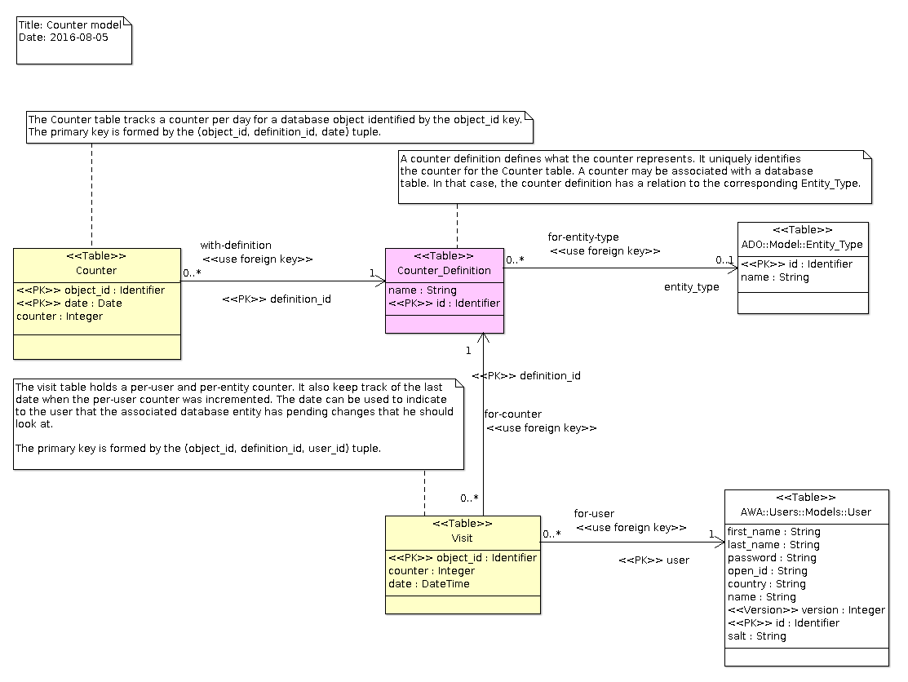

# Counters Module
The `counters` module defines a general purpose counter service that
allows to associate counters to database entities.  For example it
can be used to track the number of times a blog post or a wiki page
is accessed.  The `counters` module maintains the counters in a table
on a per-day and per-entity basis.  It allows to update the full counter
in the target database entity table.

## Integration
The `Counter_Module` manages the counters associated with database entities.
To avoid having to update the database each time a counter is incremented,
counters are kept temporarily in a `Counter_Table` protected type.
The table contains only the partial increments and not the real counter
values.  Counters are flushed when the table reaches some limit, or,
when the table is oldest than some limit.  Counters are associated with
a day so that it becomes possible to gather per-day counters.
The table is also flushed when a counter is incremented in a different day.

To be able to use the `Counters` module, you will need to add the
following line in your GNAT project file:

```Ada
with "awa_counters";
```

An instance of the `Counter_Module` must be declared and registered in the
AWA application.  The module instance can be defined as follows:

```Ada
with AWA.Counters.Modules;
...
type Application is new AWA.Applications.Application with record
   Counter_Module : aliased AWA.Counters.Modules.Counter_Module;
end record;
```

And registered in the `Initialize_Modules` procedure by using:

```Ada
Register (App    => App.Self.all'Access,
          Name   => AWA.Counters.Modules.NAME,
          Module => App.Counter_Module'Access);
```

## Configuration
The `counters` module defines the following configuration parameters:

| Name                      | Description                                                    |
|:--------------------------|:---------------------------------------------------------------|
|counters.counter_age_limit|The maximum age limit in seconds for a pending counter increment to stay in the internal table. When a pending counter reaches this age limit, the pending counter increments are flushed and the table is cleared. The default is 5 minutes.|
| |300|
|counters.counter_limit|The maximum number of different counters which can be stored in the internal table before flushing the pending increments to the database. When this limit is reached, the pending counter increments are flushed and the table is cleared.|
| |1000|

## Counter Declaration
Each counter must be declared by instantiating the `Definition` package.
This instantiation serves as identification of the counter and it defines
the database table as well as the column in that table that will hold
the total counter.  The following definition is used for the read counter
of a wiki page.  The wiki page table contains a `read_count` column
and it will be incremented each time the counter is incremented.

```Ada
 with AWA.Counters.Definition;
 ...
 package Read_Counter is
    new AWA.Counters.Definition
       (AWA.Wikis.Models.WIKI_PAGE_TABLE, "read_count");
```

When the database table does not contain any counter column, the column
field name is not given and the counter definition is defined as follows:

```Ada
 with AWA.Counters.Definition;
 ...
 package Login_Counter is
    new AWA.Counters.Definition (AWA.Users.Models.USER_PAGE_TABLE);
```

Sometimes a counter is not associated with any database entity.
Such counters are global and they are assigned a unique name.

```Ada
 with AWA.Counters.Definition;
 ...
 package Start_Counter is
    new AWA.Counters.Definition (null, "startup_counter");
```

## Incrementing the counter
Incrementing the counter is done by calling the `Increment` operation.
When the counter is associated with a database entity, the entity
primary key must be given.  The counter is not immediately incremented
in the database so that several calls to the `Increment` operation will
not trigger a database update.

```Ada
 with AWA.Counters;
 ...
 AWA.Counters.Increment (Counter => Read_Counter.Counter, Key => Id);
```

A global counter is also incremented by using the `Increment` operation.

```Ada
 with AWA.Counters;
 ...
 AWA.Counters.Increment (Counter => Start_Counter.Counter);
```

## Ada Bean
The `Counter_Bean` allows to represent a counter associated with some database
entity and allows its control by the `<awa:counter>` HTML component.
To use it, an instance of the `Counter_Bean` should be defined in a another
Ada bean declaration and configured.  For example, it may be declared
as follows:

```Ada
type Wiki_View_Bean is new AWA.Wikis.Models.Wiki_View_Info
with record
  ...
  Counter : aliased Counter_Bean
     (Of_Type => ADO.Objects.KEY_INTEGER,
      Of_Class => AWA.Wikis.Models.WIKI_PAGE_TABLE);
end record;
```

The counter value is held by the `Value` member of `Counter_Bean` and
it should be initialized programatically when the Ada bean instance
is loaded (for example through a `load` action).
The `Counter_Bean` needs to know the database entity to which it
is associated and its `Object` member must be initialized.
This is necessary for the `<awa:counter>` HTML component to increment
the associated counter when the page is displayed.
Below is an extract of such initialization:

```Ada
procedure Load
  (Bean    : in out Wiki_View_Bean;
   Outcome : in out Ada.Strings.Unbounded.Unbounded_String) is
begin
  ...
  Bean.Counter.Value := Bean.Get_Read_Count;
  ADO.Objects.Set_Value (Bean.Counter.Object, Bean.Get_Id);
end Load;

```

The `Stat_List_Bean` allows to retrieve the list of counters per day for
a given database entity.  It needs a special managed bean configuration
that describes the database entity type, the counter name and
SQL query name.

The example below from the [Wikis Module](AWA_Wikis.md) declares the bean
`wikiPageStats`.  The database entity is `awa_wiki_page` which is the
name of the database table that holds wiki page.  The SQL query
to retrieve the result is `page-access-stats`.

 <managed-bean>
```Ada
<description>The counter statistics for a wiki page</description>
<managed-bean-name>wikiPageStats</managed-bean-name>
<managed-bean-class>AWA.Counters.Beans.Stat_List_Bean</managed-bean-class>
<managed-bean-scope>request</managed-bean-scope>
<managed-property>
  <property-name>entity_type</property-name>
  <property-class>String</property-class>
  <value>awa_wiki_page</value>
</managed-property>
<managed-property>
  <property-name>counter_name</property-name>
  <property-class>String</property-class>
  <value>read_count</value>
</managed-property>
<managed-property>
  <property-name>query_name</property-name>
  <property-class>String</property-class>
  <value>page-access-stats</value>
</managed-property>
 </managed-bean>
```

A typical XHTML view that wants to use such bean, should call the `load`
action at beginning to load the counter statistics by running the SQL
query.

```Ada
<f:view contentType="application/json; charset=UTF-8"
        xmlns:f="http://java.sun.com/jsf/core"
        xmlns:h="http://java.sun.com/jsf/html">
  <f:metadata>
    <f:viewAction action='#{wikiPageStats.load}'/>
  </f:metadata>
{"data":[<h:list value="#{wikiPageStats.stats}"
  var="stat">["#{stat.date}", #{stat.count}],</h:list>[0,0]]}
</f:view>
```

## HTML components
The `<awa:counter>` component is an [Ada Server Faces](https://github.com/stcarrez/ada-asf) component that
allows to increment and display easily the counter.  The component
works by using the `Counter_Bean` Ada bean object which describes
the counter in terms of counter definition, the
associated database entity, and the current counter value.

```Ada
<awa:counter value="#{wikiPage.counter}"/>
```

When the component is included in a page the `Counter_Bean` instance
associated with the EL `value` attribute is used to increment the counter.
This is similar to calling the `AWA.Counters.Increment` operation
from the Ada code.

## Data model
The `counters` module has a simple database model which needs two tables.
The `Counter_Definition` table is used to keep track of the different
counters used by the application.  A row in that table is created for
each counter declared by instantiating the `Definition` package.
The `Counter` table holds the counters for each database entity
and for each day.  By looking at that table, it becomes possible
to look at the daily access or usage of the counter.




