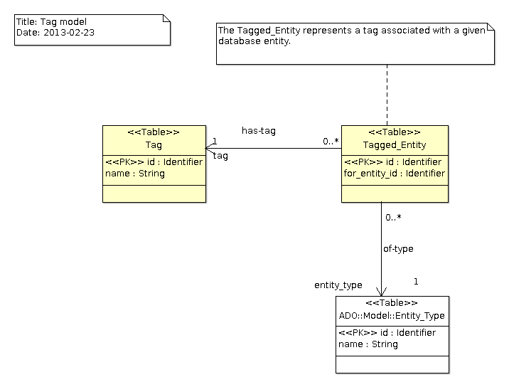

# Tags Module
The `Tags` module allows to associate general purpose tags to any database entity.
It provides a JSF component that allows to insert easily a list of tags in a page and
in a form.  An application can use the bean types defined in `AWA.Tags.Beans`
to define the tags and it will use the `awa:tagList` component to display them.
A tag cloud is also provided by the `awa:tagCloud` component.

## Integration
The <tt>Tag_Module</tt> manages the tags associated with entities.  It provides operations
that are used by the tag beans together with the <tt>awa:tagList</tt> and
<tt>awa:tagCloud</tt> components to manage the tags.
An instance of the <tt>Tag_Module</tt> must be declared and registered in the AWA application.
The module instance can be defined as follows:

```Ada
type Application is new AWA.Applications.Application with record
   Tag_Module : aliased AWA.Tags.Modules.Tag_Module;
end record;
```

And registered in the `Initialize_Modules` procedure by using:

```Ada
Register (App    => App.Self.all'Access,
          Name   => AWA.Tags.Modules.NAME,
          URI    => "tags",
          Module => App.Tag_Module'Access);
```
## Ada Beans
Several bean types are provided to represent and manage a list of tags.
The tag module registers the bean constructors when it is initialized.
To use them, one must declare a bean definition in the application XML configuration.

### Tag_List_Bean
The `Tag_List_Bean` holds a list of tags and provides operations used by the
`awa:tagList` component to add or remove tags within a `h:form` component.
A bean can be declared and configured as follows in the XML application configuration file:

```Ada
<managed-bean>
  <managed-bean-name>questionTags</managed-bean-name>
  <managed-bean-class>AWA.Tags.Beans.Tag_List_Bean</managed-bean-class>
  <managed-bean-scope>request</managed-bean-scope>
  <managed-property>
    <property-name>entity_type</property-name>
    <property-class>String</property-class>
    <value>awa_question</value>
  </managed-property>
  <managed-property>
    <property-name>permission</property-name>
    <property-class>String</property-class>
    <value>question-edit</value>
  </managed-property>
</managed-bean>
```

The `entity_type` property defines the name of the database table to which the tags
are assigned.  The `permission` property defines the permission name that must be used
to verify that the user has the permission do add or remove the tag.  Such permission is
verified only when the `awa:tagList` component is used within a form.

### Tag_Search_Bean
The `Tag_Search_Bean` is dedicated to searching for tags that start with a given
pattern.  The auto complete feature of the `awa:tagList` component can use this
bean type to look in the database for tags matching a start pattern.  The declaration of the
bean should define the database table to search for tags associated with a given database
table.  This is done in the XML configuration with the `entity_type` property.

```Ada
<managed-bean>
  <managed-bean-name>questionTagSearch</managed-bean-name>
  <managed-bean-class>AWA.Tags.Beans.Tag_Search_Bean</managed-bean-class>
  <managed-bean-scope>request</managed-bean-scope>
  <managed-property>
    <property-name>entity_type</property-name>
    <property-class>String</property-class>
    <value>awa_question</value>
  </managed-property>
</managed-bean>
```

### Tag_Info_List_Bean
The <tt>Tag_Info_List_Bean</tt> holds a collection of tags with their weight.  It is used
by the <tt>awa:tagCloud</tt> component.

```Ada
<managed-bean>
  <managed-bean-name>questionTagList</managed-bean-name>
  <managed-bean-class>AWA.Tags.Beans.Tag_Info_List_Bean</managed-bean-class>
  <managed-bean-scope>request</managed-bean-scope>
  <managed-property>
    <property-name>entity_type</property-name>
    <property-class>String</property-class>
    <value>awa_question</value>
  </managed-property>
</managed-bean>
```


#### AWA.Tags.Models.Tag_Info

The tag information.

| Type     | Ada      | Name       | Description                                             |
|:---------|:---------|:-----------|:--------------------------------------------------------|
||String|tag|the tag name.|
||Natural|count|the number of references for the tag.|


## HTML components

### Displaying a list of tags
The <tt>awa:tagList</tt> component displays a list of tags.  Each tag can be rendered as
a link if the <tt>tagLink</tt> attribute is defined.  The list of tags is passed in the
<tt>value</tt> attribute.  When rending that list, the <tt>var</tt> attribute is used to
setup a variable with the tag value.  The <tt>tagLink</tt> attribute is then evaluated
against that variable and the result defines the link.

```Ada
<awa:tagList value='#{questionList.tags}' id='qtags' styleClass="tagedit-list"
             tagLink="#{contextPath}/questions/tagged.html?tag=#{tagName}"
             var="tagName"
             tagClass="tagedit-listelement tagedit-listelement-old"/>
```

### Tag editing
The <tt>awa:tagList</tt> component allows to add or remove tags associated with a given
database entity.  The tag management works with the jQuery plugin <b>Tagedit</b>.  For this,
the page must include the <b>/js/jquery.tagedit.js</b> Javascript resource.

The tag edition is active only if the <tt>awa:tagList</tt> component is placed within an
<tt>h:form</tt> component.  The <tt>value</tt> attribute defines the list of tags.  This must
be a <tt>Tag_List_Bean</tt> object.

```Ada
<awa:tagList value='#{question.tags}' id='qtags'
             autoCompleteUrl='#{contextPath}/questions/lists/tag-search.html'/>
```

When the form is submitted and validated, the procedure <tt>Set_Added</tt> and
<tt>Set_Deleted</tt> are called on the value bean with the list of tags that were
added and removed.  These operations are called in the <tt>UPDATE_MODEL_VALUES</tt>
phase (ie, before calling the action's bean operation).

### Tag cloud
The <tt>awa:tagCloud</tt> component displays a list of tags as a tag cloud.
The tags list passed in the <tt>value</tt> attribute must inherit from the
<tt>Tag_Info_List_Bean</tt> type which indicates for each tag the number of
times it is used.

```Ada
<awa:tagCloud value='#{questionTagList}' id='cloud' styleClass="tag-cloud"
              var="tagName" rows="30"
              tagLink="#{contextPath}/questions/tagged.html?tag=#{tagName}"
              tagClass="tag-link"/>
```

## Queries

| Name              | Description                                                           |
|:------------------|:----------------------------------------------------------------------|
|check-tag|Check and get the tag identifier associated with a given tag and entity|
|tag-list|Get the list of tags associated with a given database entity|
|tag-search|Get the list of tag names that match some string|
|tag-list-all|Get the list of tags associated with all the database entities of a given type|
|tag-list-for-entities|Get the list of tags associated with a set of entities of the same type.|


## Data model
The database model is generic and it uses the `Entity_Type` provided by
[Ada Database Objects](https://github.com/stcarrez/ada-ado) to associate a tag to entities stored in different
tables.  The `Entity_Type` identifies the database table and the stored identifier
in `for_entity_id` defines the entity in that table.




