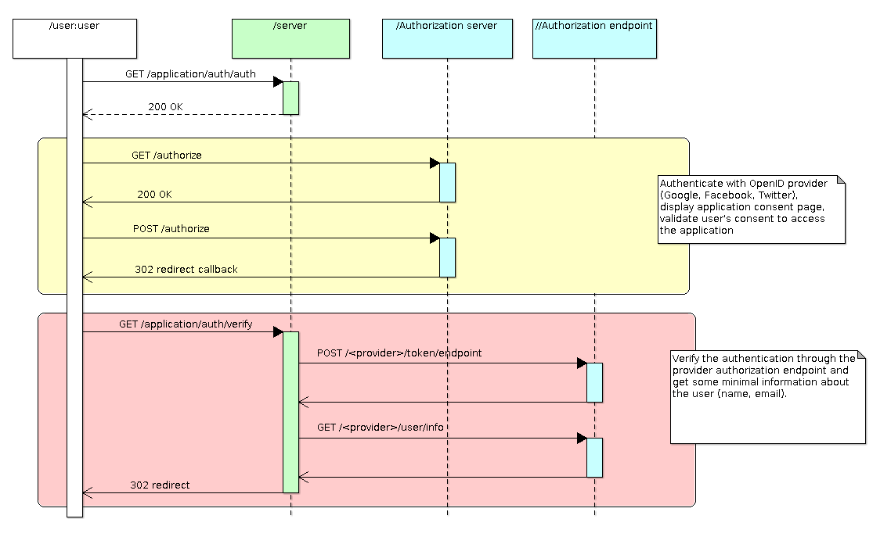

# Users Module
The `users` module manages the creation, update, removal and authentication
of users in an application.  The module provides the foundations for user
management in a web application.

A user can register himself by using a subscription form.  In that case,
a verification mail is sent and the user has to follow the verification
link defined in the mail to finish the registration process.  The user
will authenticate using a password.

A user can also use an OAuth/OpenID account and be automatically authenticated
and registered to the application.  By using an external authentication
server, passwords are not stored in the application.

A user can have one or several permissions that allow to protect the
application data.  User permissions are managed by the `Permissions.Module`.

## Integration
The `User_Module` manages the creation, update, removal of users
in an application.  It provides operations that are used by the user
beans or other services to create and update wiki pages.
An instance of the `User_Module` must be declared and registered in the
AWA application.  The module instance can be defined as follows:

```Ada
type Application is new AWA.Applications.Application with record
   User_Module : aliased AWA.Users.Modules.User_Module;
end record;
```

And registered in the `Initialize_Modules` procedure by using:

```Ada
Register (App    => App.Self.all'Access,
          Name   => AWA.Users.Modules.NAME,
          Module => App.User_Module'Access);
```

## OAuth Authentication Flow
The OAuth/OpenID authentication flow is implemented by using two servlets
that participate in the authentication.  A first servlet will start
the OAuth/OpenID authentication by building the request that the user
must use to authenticate through the OAuth/OpenID authorization server.
This servlet is implemented by the `AWA.Users.Servlets.Request_Auth_Servlet`
type.  The servlet will respond to an HTTP `GET` request and it will
redirect the user to the authorization server.



The user will be authenticated by the OAuth/OpenID authorization server
and when s/he grants the application to access his or her account,
a redirection is made to the second servlet.  The second servlet
is implemented by `AWA.Users.Servlets.Verify_Auth_Servlet`.  It is used
to validate the authentication result by checking its validity with
the OAuth/OpenID authorization endpoint.  During this step, we can
retrieve some minimal information that uniquely identifies the user
such as a unique identifier that is specific to the OAuth/OpenID
authorization server.  It is also possible to retrieve the
user's name and email address.

These two servlets are provided by the `User_Module` and they are
registered under the `openid-auth` name for the first step and
under the `openid-verify` name for the second step.

## Configuration
The *users* module uses a set of configuration properties to configure
the OpenID integration.

| Name                      | Description                                                    |
|:--------------------------|:---------------------------------------------------------------|
|users.server_id|The server id when several instances are used.|
| |1|
|users.auth_key|An authentication key used to sign the authentication cookies.|
| |8ef60aad66977c68b12f4f8acab5a4e00a77f6e8|
|users.allow_register|Allow users to register themselves on the server. When disabled, users can be created by the AWA 'user' command.|
| |#{app_login_register}|
|openid.realm|The REALM URL used by OpenID providers to verify the validity of the verification callback.|
| |#{app_url_base}/auth|
|openid.callback_url|The verification callback URI used by the OpenID provider to redirect the user after authentication.|
| |#{app_url_base}/auth/verify|
|openid.success_url|The URI where the user is redirected after a successful authentication.|
| |#{contextPath}/workspaces/main.html|
|openid.error_url|The URI where the user is redirected when some authenticate error occurred.|
| |#{contextPath}/auth/login.html|
|auth.url.orange|Orange OpenID access point|
| |https://openid.orange.fr|
|auth.provider.orange|Auth provider to use for Orange|
| |openid|
|auth.url.yahoo|Yahoo! OpenID access point|
| |https://api.login.yahoo.com/oauth2/request_auth|
|auth.provider.yahoo|Auth provider to use for Yahoo!|
| |yahoo|
|auth.url.google|Google OpenID access point|
| |https://www.google.com/accounts/o8/id|
|auth.provider.google|Auth provider to use for Google|
| |openid|
|auth.url.github|GitHub OAuth2 Connect access point|
| |https://github.com/login/oauth/authorize|
|auth.provider.github|Auth provider to use for GitHub|
| |github|
|github.request_url|GitHub OAuth token access point|
| |https://github.com/login/oauth/access_token|
|github.scope|GitHub OAuth scope|
| |read:user, read:email|
|github.callback_url|GitHub verify callback|
| |#{app_oauth_url_base}#{contextPath}/auth/verify|
|github.issuer|GitHub issuer identification|
| |https://github.com|
|auth.url.gitlab|GitLab OAuth2 Connect access point|
| |https://gitlab.com/oauth/authorize|
|auth.provider.gitlab|Auth provider to use for GitLab|
| |yahoo|
|gitlab.request_url|Gitlab OAuth token access point|
| |https://gitlab.com/oauth/token|
|gitlab.scope|Gitlab OAuth scope|
| |openid email|
|gitlab.callback_url|Gitlab verify callback|
| |#{app_oauth_url_base}#{contextPath}/auth/verify|
|gitlab.issuer|Gitlab issuer identification|
| |https://gitlab.com|
|auth.url.twitter|Twitter OAuth2 Connect access point|
| |https://api.twitter.com/oauth/authenticate|
|auth.provider.twitter|Auth provider to use for Twitter|
| |yahoo|
|auth.url.facebook|Facebook OAuth access point|
| |https://www.facebook.com/dialog/oauth|
|auth.provider.facebook|Auth provider to use for Facebook|
| |facebook|
|facebook.callback_url|Facebook verify callback|
| |#{app_oauth_url_base}#{contextPath}/auth/verify|
|facebook.request_url|Facebook request OAuth token access point|
| |https://graph.facebook.com/oauth/access_token|
|facebook.scope|Facebook permission scope|
| |public_profile,email|
|facebook.client_id|Facebook API client ID|
| |#{app_facebook_client_id}|
|facebook.secret|Facebook API secret|
| |#{app_facebook_secret}|
|auth.url.google-plus|Google+ OAuth access point|
| |https://accounts.google.com/o/oauth2/auth|
|auth.provider.google-plus|Auth provider to use for Google+|
| |google-plus|
|google-plus.issuer|Google+ issuer identification|
| |accounts.google.com|
|google-plus.callback_url|Google+ verify callback|
| |#{app_oauth_url_base}#{contextPath}/auth/verify|
|google-plus.request_url|Google+ request OAuth token access point|
| |https://accounts.google.com/o/oauth2/token|
|google-plus.scope|Google+ permission scope|
| |openid profile email|
|google-plus.client_id|Google+ API client ID|
| |#{app_google_plus_client_id}|
|google-plus.secret|Google+ API secret|
| |#{app_google_plus_secret}|
|auth-filter.redirect|URI to redirect to the login page|
| |#{contextPath}/auth/login.html|
|verify-access-key.redirect|URI to redirect to the login page|
| |#{contextPath}/auth/login.html|
|verify-access-key.change-password|URI to redirect to the change password page when the access key is verified, the user account is registered but there is no password for authentication|
| |#{contextPath}/auth/change-password/|
|app_login_register|Enable or disable user registration through the web interface|
| |#{not empty app_login_register ? app_login_register : true}|
|app_login_email|Enable or disable user login through the email/password form|
| |#{not empty app_login_email ? app_login_email : true}|
|app_login_openid|Enable or disable user login through OpenID/OAuth2|
| |#{not empty app_login_openid ? app_login_openid : true}|
|app_login_methods|List of login methods which are enabled for authentication|
| |#{not empty app_login_methods ? app_login_methods : 'email,google,facebook'}|

## Ada Beans
Several bean types are provided to represent and manage the users.
The user module registers the bean constructors when it is initialized.
To use them, one must declare a bean definition in the application
XML configuration.

| Name           | Description                                                               |
|:---------------|:--------------------------------------------------------------------------|
|login|This bean is used by the login form|
|register|This bean is used by the registration form|
|resetPassword|This bean is used by the reset password form|
|lostPassword|This bean is used by the lost password form|
|logout|This bean is used by the logout process|
|user|This bean allows to provide information about the current logged user.|

## Data model


