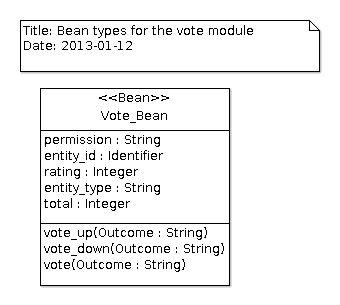

# Votes Module
The `votes` module allows users to vote for objects defined in the
application.  Users can vote by setting a rating value on an item
(+1, -1 or any other integer value).  The `votes` module makes sure
that users can vote only once for an item.  A global rating
is associated with the item to give the vote summary.  The vote can
be associated with any database entity and it is not necessary to
change other entities in your data model.

## Integration
To be able to use the `votes` module, you will need to add the
following line in your GNAT project file:

```Ada
with "awa_votes";
```

The `Vote_Module` manages the votes on entities.  It provides operations
that are used by the vote beans or other services to vote for an item.
An instance of the `Vote_Module` must be declared and registered
in the AWA application.

The module instance can be defined as follows:

```Ada
type Application is new AWA.Applications.Application with record
   Vote_Module : aliased AWA.Votes.Modules.Vote_Module;
end record;
```

And registered in the `Initialize_Modules` procedure by using:

```Ada
Register (App    => App.Self.all'Access,
          Name   => AWA.Votes.Modules.NAME,
          URI    => "votes",
          Module => App.Vote_Module'Access);
```
## Ada Beans
The `Vote_Bean` is a bean intended to be used in presentation files (XHTML facelet
files) to vote for an item.  The managed bean can be easily configured in the application XML
configuration file.  The `permission` and `entity_type` are the two properties
that should be defined in the configuration.  The `permission` is the name of the
permission that must be used to verify that the user is allowed to vote for the item.
The `entity_type` is the name of the entity (table name) used by the item.
The example below defines the bean `questionVote` defined by the question module.

```Ada
<managed-bean>
  <description>The vote bean that allows to vote for a question.</description>
  <managed-bean-name>questionVote</managed-bean-name>
  <managed-bean-class>AWA.Votes.Beans.Votes_Bean</managed-bean-class>
  <managed-bean-scope>request</managed-bean-scope>
  <managed-property>
    <property-name>permission</property-name>
    <property-class>String</property-class>
    <value>answer-create</value>
  </managed-property>
  <managed-property>
    <property-name>entity_type</property-name>
    <property-class>String</property-class>
    <value>awa_question</value>
  </managed-property>
</managed-bean>
```

The vote concerns entities for the `awa_question` entity table.
The permission `answer-create` is used to verify that the vote is allowed.



The managed bean defines three operations that can be called: `vote_up`,
`vote_down` and `vote` to setup specific ratings.

## Javascript integration
The `votes` module provides a Javascript support to help users vote
for items.  The Javascript file `/js/awa-votes.js` must be included
in the Javascript page.  It is based on jQuery and ASF.  The vote
actions are activated on the page items as follows in XHTML facelet files:

```Ada
<util:script>
  $('.question-vote').votes({
    voteUrl: "#{contextPath}/questions/ajax/questionVote/vote?id=",
    itemPrefix: "vote_for-"
});
</util:script>
```

When the vote up or down HTML element is clicked, the `vote` operation
of the managed bean `questionVote` is called.  The operation will
update the user's vote for the selected item (in the example "a question").

## Data model


