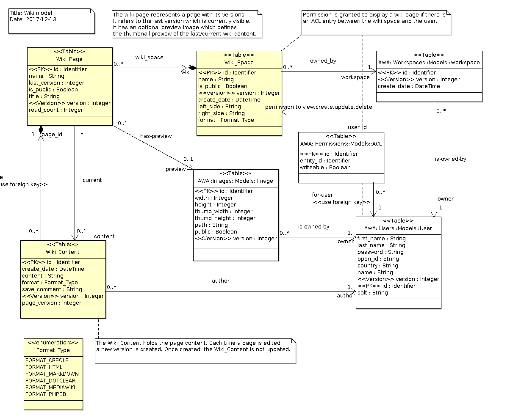

# Wikis Module
The `Wikis` module provides a complete wiki system which allows users to create
their own wiki environment with their wiki pages.

## Integration
To be able to use the `Wikis` module, you will need to add the following
line in your GNAT project file:

```Ada
with "awa_wikis";
```

The `Wiki_Module` manages the creation, update, removal of wiki pages
in an application. It provides operations that are used by the wiki beans
or other services to create and update wiki pages.  An instance of
the `Wiki_Module` must be declared and registered in the
AWA application.  The module instance can be defined as follows:

```Ada
with AWA.Wikis.Modules;
...
type Application is new AWA.Applications.Application with record
   Wiki_Module : aliased AWA.Wikis.Modules.Wiki_Module;
end record;
```

And registered in the `Initialize_Modules` procedure by using:

```Ada
Register (App    => App.Self.all'Access,
          Name   => AWA.Wikis.Modules.NAME,
          URI    => "wikis",
          Module => App.Wiki_Module'Access);
```

## Configuration

| Name                      | Description                                                    |
|:--------------------------|:---------------------------------------------------------------|
|wikis.image_prefix|The URL base prefix to be used for Wiki images.|
| |#{contextPath}/wikis/images/|
|wikis.page_prefix|The URL base prefix to be used for Wiki pages.|
| |#{contextPath}/wikis/view/|
|wikis.wiki_copy_list|A list of wiki page ID top copy when a new wiki space is created.|
| ||


## Events
The `wikis` exposes a number of events which are posted when some action
are performed at the service level.

| Event name          | Description                                                   |
|:--------------------|:--------------------------------------------------------------|
| wiki-create-page    | This event is posted when a new wiki page is created.         |
| wiki-create-content | This event is posted when a new wiki page content is created. |
|                     | Each time a wiki page is modified, a new wiki page content    |
|                     | is created and this event is posted.                          |


## Ada Beans
Several bean types are provided to represent and manage the blogs and their posts.
The blog module registers the bean constructors when it is initialized.
To use them, one must declare a bean definition in the application XML configuration.


| Name           | Description                                                               |
|:---------------|:--------------------------------------------------------------------------|
|wikiView|The wiki page with all its information to display it.|
|wikiImageInfo|The information about an image used by a wiki page.|
|wikiPageInfo|The wiki page information bean gives the various statistics and information about a wiki page.|
|wikiFormatList|A localized list of wiki page formats to be used for a f:selectItems|
|adminWiki|The list of wikis and pages that the current user can access and update.|
|adminWikiSpace|The wiki space bean to create and edit the wiki space configuration.|
|wikiPage|The wiki page bean gives the full content and information about a wiki page.|
|wikiList|The list of wiki pages.|
|wikiVersionList|The list of wiki page versions.|
|wikiTagSearch|The wiki tag search bean.|
|wikiTagCloud|The list of tags associated with a wiki page entities.|
|wikiTags|The wiki tag editor bean.|
|wikiPageStats|The counter statistics for a wiki page|


#### AWA.Wikis.Models.Wiki_View_Info

The information about a wiki page.

| Type     | Ada      | Name       | Description                                             |
|:---------|:---------|:-----------|:--------------------------------------------------------|
||Identifier|id|the wiki page identifier.|
||String|name|the wiki page name.|
||String|title|the wiki page title.|
||Boolean|is_public|whether the wiki is public.|
||Nullable_Integer|version|the last version.|
||Nullable_Integer|read_count|the number of times the page was displayed.|
||Nullable_Date|date|the wiki page creation date.|
||AWA.Wikis.Models.Format_Type|format|the wiki page format.|
||String|content|the wiki page content.|
||String|save_comment|the wiki version comment.|
||String|left_side|the wiki page left side panel.|
||String|right_side|the wiki page right side panel.|
||AWA.Wikis.Models.Format_Type|side_format|the wiki side format.|
||String|author|the wiki page author.|
||Identifier|acl_id|the acl Id if there is one.|


#### AWA.Wikis.Models.Wiki_Page_Info

The information about a wiki page.

| Type     | Ada      | Name       | Description                                             |
|:---------|:---------|:-----------|:--------------------------------------------------------|
||Identifier|id|the wiki page identifier.|
||String|name|the wiki page name.|
||String|title|the wiki page title.|
||Boolean|is_public|whether the wiki is public.|
||Integer|last_version|the last version.|
||Integer|read_count|the read count.|
||Date|create_date|the wiki creation date.|
||String|author|the wiki page author.|


#### AWA.Wikis.Models.Wiki_Version_Info

The information about a wiki page version.

| Type     | Ada      | Name       | Description                                             |
|:---------|:---------|:-----------|:--------------------------------------------------------|
||Identifier|id|the wiki page identifier.|
||String|comment|the wiki page version comment.|
||Date|create_date|the wiki page creation date.|
||Integer|page_version|the page version.|
||String|author|the wiki page author.|


#### AWA.Wikis.Models.Wiki_Info

The list of wikis.

| Type     | Ada      | Name       | Description                                             |
|:---------|:---------|:-----------|:--------------------------------------------------------|
||Identifier|id|the wiki space identifier.|
||String|name|the wiki name.|
||Boolean|is_public|whether the wiki is public.|
||Date|create_date|the wiki creation date.|
||Integer|page_count|the number of pages in the wiki.|


## Queries

| Name              | Description                                                           |
|:------------------|:----------------------------------------------------------------------|
|wiki-page|Get the content of a wiki page.|
|wiki-page-id|Get the content of a wiki page.|
|wiki-page-content|Get only the content of a wiki page (for template evaluation).|
|wiki-page-name-count|Count the occurence of a wiki page name|


| Name              | Description                                                           |
|:------------------|:----------------------------------------------------------------------|
|wiki-page-list|Get the list of wiki pages|
|wiki-page-tag-list|Get the list of wiki pages filtered by a tag|


| Name              | Description                                                           |
|:------------------|:----------------------------------------------------------------------|
|wiki-version-list|Get the list of wiki page versions|


| Name              | Description                                                           |
|:------------------|:----------------------------------------------------------------------|
|wiki-list|Get the list of wikis that the current user can update|


| Name              | Description                                                           |
|:------------------|:----------------------------------------------------------------------|
|wiki-image-get-data|Get the data content of the Wiki image (original image).|
|wiki-image-width-get-data|Get the data content of the Wiki image for an image with a given width.|
|wiki-image-height-get-data|Get the data content of the Wiki image for an image with a given height.|


| Name              | Description                                                           |
|:------------------|:----------------------------------------------------------------------|
|wiki-image|Get the description of an image used in a wiki page.|


| Name              | Description                                                           |
|:------------------|:----------------------------------------------------------------------|
|page-access-stats|Get statistics about the wiki page access.|


## Data model



