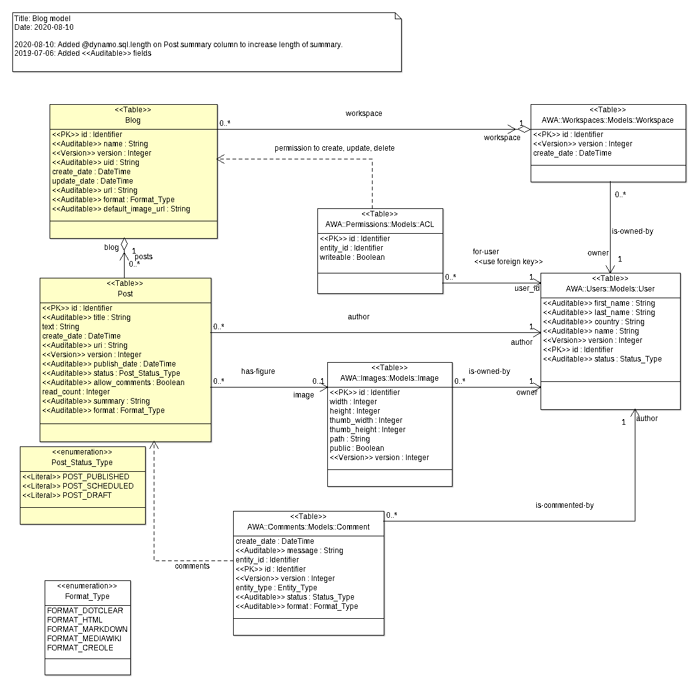

# Blogs Module
The `blogs` module is a small blog application which allows users
to publish articles.  A user may own several blogs, each blog having
a name and its own base URI.  Within a blog, the user may write articles
and publish them.  Once published, the articles are visible to
anonymous users.

The `blogs` module uses several other modules:

* the [Counters Module](AWA_Counters.md) to track page display counter to a blog post,
* the [Tags Module](AWA_Tags.md) to associate one or several tags to a blog post,
* the [Comments Module](AWA_Comments.md) to allow users to write comments on a blog post,
* the [Images Module](AWA_Images.md) to easily add images in blog post.
* the [SEO Module](AWA_SEO.md) for the generation of sitemap entries for the blog posts.

## Integration
To be able to use the `Blogs` module, you will need to add the following line in your
GNAT project file:

```Ada
with "awa_blogs";
```

The `Blog_Module` type manages the creation, update, removal of blog posts in an application.
It provides operations that are used by the blog beans or other services to create and update
posts.  An instance of the `Blog_Module` must be declared and registered in the
AWA application.  The module instance can be defined as follows:

```Ada
with AWA.Blogs.Modules;
...
type Application is new AWA.Applications.Application with record
   Blog_Module : aliased AWA.Blogs.Modules.Blog_Module;
end record;
```

And registered in the `Initialize_Modules` procedure by using:

```Ada
Register (App    => App.Self.all'Access,
          Name   => AWA.Blogs.Modules.NAME,
          URI    => "blogs",
          Module => App.Blog_Module'Access);
```

## Permissions
Permissions are defined to control who is allowed to create, update and delete blog posts:

| Name           | Entity type  | Description                                                |
|:---------------|:-------------|:-----------------------------------------------------------|
|blog-create|awa_workspace|Permission to create a new blog.|
|blog-delete|awa_blog|Permission to delete a blog.|
|blog-create-post|awa_blog|Permission to create a new post.|
|blog-update-post|awa_blog|Permission to modify a post.|
|blog-delete-post|awa_blog|Permission to delete a post.|
|blog-add-comment|awa_blog||
|blog-publish-comment|awa_blog|Permission to change the publish status of a comment.|
|blog-delete-comment|awa_blog|Permission to delete the comment.|

## Configuration
The `Blogs` module defines the following configuration parameters:

| Name                      | Description                                                    |
|:--------------------------|:---------------------------------------------------------------|
|blogs.image_prefix|The URL base prefix to be used for blog post images.|
| |#{contextPath}/blogs/images/|
|blogs.post_uri|The post URI to write in generated sitemaps. The URI must be absolute and specify the host and domain. This EL expression is evaluated twice: a first time during application setup and a second time for each URI that must be generated. The blog post base URI is defined in the variable #{uri} (be careful to escape the '#' by using \#{uri} due to the double EL evaluation).|
| |#{app_url_base}/blogs/posts/\#{uri}|
|blogs.image_uri|The image URI to write in generated sitemaps. Similar to the blogs.post_uri, this must be absolute and specify the host and domain. This EL expression is evaluated twice: a first time during application setup and a second time for each URI that must be generated. The blog post base URI is defined in the variable #{post_id} (be careful to escape the '#' by using \#{post_id} due to the double EL evaluation).|
| |#{app_url_base}/blogs/images/\#{post_id}/\#{image_id}/default/\#{image_title}|

## Ada Beans
Several bean types are provided to represent and manage the blogs and their posts.
The blog module registers the bean constructors when it is initialized.
To use them, one must declare a bean definition in the application XML configuration.

| Name           | Description                                                               |
|:---------------|:--------------------------------------------------------------------------|
|post|This bean describes a blog post for the creation or the update|
|postList|This bean describes a blog post for the creation or the update|
|postStatusList|A localized list of post statuses to be used for a f:selectItems|
|postAccessStats|The counter statistics for a blog post|
|blogFormatList|A localized list of blog post formats to be used for a f:selectItems|
|adminBlog|The list of blogs and posts that the current user can access and update.|
|blog|Information about the current blog.|
|feed_blog|Information about the RSS feed blog.|
|blogTagSearch|The blog tag search bean.|
|blogTagCloud|A list of tags associated with all post entities.|
|postComments|A list of comments associated with a post.|
|postAdminComments|A list of all comments associated with a post (for admin purposes).|
|postNewComment|The bean to allow a user to post a new comment. This is a specific bean because the permission to create a new post is different from other permissions. If the permission is granted, the comment will be created and put in the COMMENT_WAITING state. An email will be sent to the post author for approval.|
|blogPublishComment|The bean to allow the blog administrator to change the publication status of a comment.|
|blogDeleteComment|The bean to allow the blog administrator to change the publication status of a comment.|
|commentEdit|The bean to allow a user to edit the comment. This is a specific bean because the permission to edit the comment is different from other permissions.|
|blogStats|This bean provides statistics about the blog|

#### AWA.Blogs.Models.Admin_Post_Info

The Admin_Post_Info describes a post in the administration interface.

| Type     | Ada      | Name       | Description                                             |
|:---------|:---------|:-----------|:--------------------------------------------------------|
||Identifier|id|the post identifier.|
||String|title|the post title.|
||String|uri|the post uri.|
||Date|date|the post publish date.|
||AWA.Blogs.Models.Post_Status_Type|status|the post status.|
||Natural|read_count|the number of times the post was read.|
||String|username|the user name.|
||Natural|comment_count|the number of comments for this post.|

#### AWA.Blogs.Models.Post_Info

The Post_Info describes a post to be displayed in the blog page

| Type     | Ada      | Name       | Description                                             |
|:---------|:---------|:-----------|:--------------------------------------------------------|
||Identifier|id|the post identifier.|
||String|title|the post title.|
||String|uri|the post uri.|
||Date|date|the post publish date.|
||String|username|the user name.|
||AWA.Blogs.Models.Format_Type|format|the post page format.|
||String|summary|the post summary.|
||String|text|the post text.|
||Boolean|allow_comments|the post allows to add comments.|
||Natural|comment_count|the number of comments for this post.|

#### AWA.Blogs.Models.Comment_Info

The comment information.

| Type     | Ada      | Name       | Description                                             |
|:---------|:---------|:-----------|:--------------------------------------------------------|
||Identifier|id|the comment identifier.|
||Identifier|post_id|the post identifier.|
||String|title|the post title.|
||String|author|the comment author's name.|
||String|email|the comment author's email.|
||Date|date|the comment date.|
||AWA.Comments.Models.Status_Type|status|the comment status.|

#### AWA.Blogs.Models.Blog_Info

The list of blogs.

| Type     | Ada      | Name       | Description                                             |
|:---------|:---------|:-----------|:--------------------------------------------------------|
||Identifier|id|the blog identifier.|
||String|title|the blog title.|
||String|uid|the blog uuid.|
||Date|create_date|the blog creation date.|
||Integer|post_count|the number of posts published.|

## Queries

| Name              | Description                                                           |
|:------------------|:----------------------------------------------------------------------|
|blog-admin-post-list|Get the list of blog posts|
|blog-admin-post-list-date|Get the list of blog posts|

| Name              | Description                                                           |
|:------------------|:----------------------------------------------------------------------|
|blog-post-list|Get the list of public visible posts|
|blog-post-tag-list|Get the list of public visible posts filtered by a tag|

| Name              | Description                                                           |
|:------------------|:----------------------------------------------------------------------|
|comment-list|Get the list of comments associated with given database entity|

| Name              | Description                                                           |
|:------------------|:----------------------------------------------------------------------|
|blog-list|Get the list of blogs that the current user can update|

| Name              | Description                                                           |
|:------------------|:----------------------------------------------------------------------|
|blog-tag-cloud|Get the list of tags associated with all the database entities of a given type|

| Name              | Description                                                           |
|:------------------|:----------------------------------------------------------------------|
|blog-image-get-data|Get the data content of the Wiki image (original image).|
|blog-image-width-get-data|Get the data content of the Wiki image for an image with a given width.|
|blog-image-height-get-data|Get the data content of the Wiki image for an image with a given height.|

| Name              | Description                                                           |
|:------------------|:----------------------------------------------------------------------|
|blog-image|Get the description of an image used in a blog post.|

| Name              | Description                                                           |
|:------------------|:----------------------------------------------------------------------|
|post-publish-stats|Get statistics about the post publication on a blog.|
|post-access-stats|Get statistics about the post publication on a blog.|

## Data model



