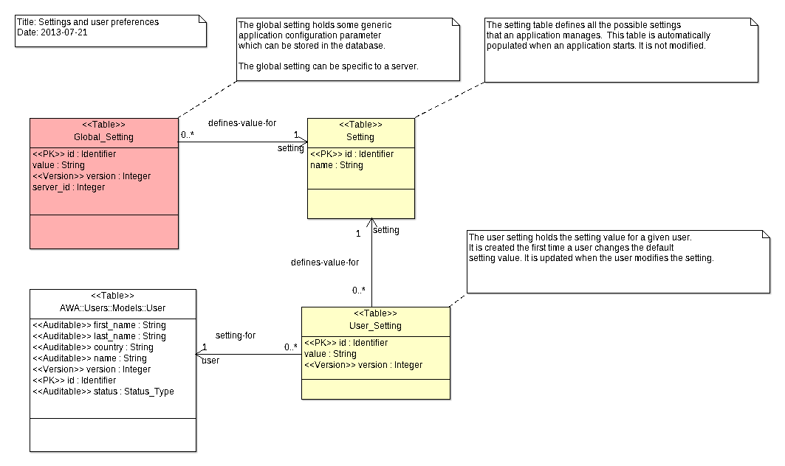

# Settings Module
The `Settings` module provides management of application and user settings.
A setting is identified by a unique name in the application.  It is saved in
the database and associated with a user.

## Getting a user setting
Getting a user setting is as simple as calling a function with the setting name
and the default value.  If the setting was modified by the user and saved in the
database, the saved value will be returned.  Otherwise, the default value is returned.
For example, if an application defines a `row-per-page` setting to define how
many rows are defined in a list, the user setting can be retrieved with:

```Ada
Row_Per_Page : constant Integer := AWA.Settings.Get_User_Setting ("row-per-page", 10);
```

## Saving a user setting
When a user changes the setting value, we just have to save it in the database.
The setting value will either be updated if it exists or created.

```Ada
AWA.Settings.Set_User_Setting ("row-per-page", 20);
```

## Integration
The `Setting_Module` manages the application and user settings.  An instance of the
the `Setting_Module` must be declared and registered in the AWA application.
The module instance can be defined as follows:

```Ada
type Application is new AWA.Applications.Application with record
   Setting_Module : aliased AWA.Settings.Modules.Setting_Module;
end record;
```

And registered in the `Initialize_Modules` procedure by using:

```Ada
Register (App    => App.Self.all'Access,
          Name   => AWA.Settings.Modules.NAME,
          URI    => "settings",
          Module => App.Setting_Module'Access);
```

## Data model


