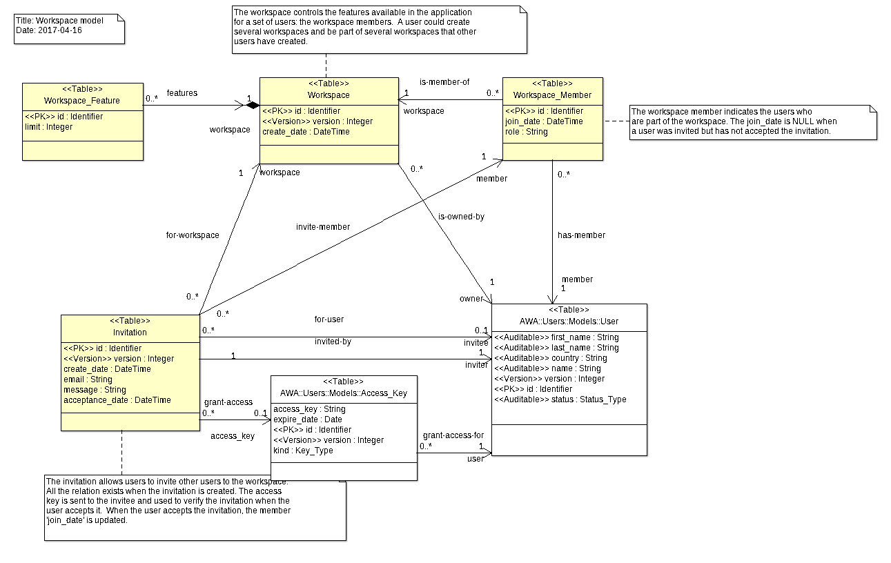

# Workspaces Module
The `Workspaces` module defines a workspace area for other plugins.
The workspace is intended to link together all the data objects that an application
manages for a given user or group of users.  A workspace is a possible mechanism
to provide and implement multi-tenancy in a web application.  By using the workspace plugin,
application data from different customers can be kept separate from each other in the
same database.

## Integration
To be able to use the `Workspaces` module, you will need to add the following
line in your GNAT project file:

```Ada
with "awa_workspaces";
```

The `Workspace_Module` manages the creation, invitation, administration of
members which are allowed to access the application.  It provides operations
that are used by the other modules to setup and control specific permissions
associated to the workspace and granted to workspace members.
An instance of the `Workspace_Module` must be declared and registered in the
AWA application.  The module instance can be defined as follows:

```Ada
with AWA.Workspaces.Modules;
...
type Application is new AWA.Applications.Application with record
   Workspace_Module : aliased AWA.Workspaces.Modules.Workspace_Module;
end record;
```

And registered in the `Initialize_Modules` procedure by using:

```Ada
Register (App    => App.Self.all'Access,
          Name   => AWA.Workspaces.Modules.NAME,
          URI    => "workspaces",
          Module => App.Workspace_Module'Access);
```

## Permissions
Permissions are defined to control who is allowed to create a workspace, invite members
in a workspace for cooperation:

| Name           | Entity type  | Description                                                |
|:---------------|:-------------|:-----------------------------------------------------------|
|workspace-create|awa_workspace|Permission to create a workspace.|
|workspace-invite-user|awa_workspace|Permission to invite a user in the workspace.|
|workspace-delete-user|awa_workspace|Permission to delete a user from the workspace.|
|workspaces-create|awa_workspace||

## Configuration

| Name                      | Description                                                    |
|:--------------------------|:---------------------------------------------------------------|
|workspaces.permissions_list|A list of permissions to grant to the user when the workspace is created.|
| |blog-create,wiki-space-create|
|workspaces.allow_workspace_create|Indicates whether new users have a dedicated workspace created when they are created and registered.|
| |0|

## Events
The `Workspaces` module provides several events that are posted when some action are performed.

### invite-user
This event is posted when an invitation is created for a user.  The event can be used to
send the associated invitation email to the invitee.  The event contains the following
attributes:

key
email
name
message
inviter

### accept-invitation
This event is posted when an invitation is accepted by a user.

## Ada Beans

### Beans

| Name           | Description                                                               |
|:---------------|:--------------------------------------------------------------------------|
|workspace|This bean allows to perform some general workspace actions|
|memberList|The list of workspace members.|
|inviteUser|The invitation bean.|
|workspaceMember|The workspace member bean.|

### Permissions

| Name           | Entity type  | Description                                                |
|:---------------|:-------------|:-----------------------------------------------------------|
|workspace-create|awa_workspace|Permission to create a workspace.|
|workspace-invite-user|awa_workspace|Permission to invite a user in the workspace.|
|workspace-delete-user|awa_workspace|Permission to delete a user from the workspace.|
|workspaces-create|awa_workspace||

### Configuration

| Name                      | Description                                                    |
|:--------------------------|:---------------------------------------------------------------|
|workspaces.permissions_list|A list of permissions to grant to the user when the workspace is created.|
| |blog-create,wiki-space-create|
|workspaces.allow_workspace_create|Indicates whether new users have a dedicated workspace created when they are created and registered.|
| |0|

## Data Model



