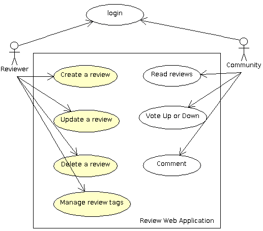
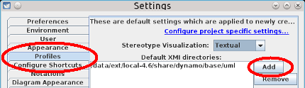
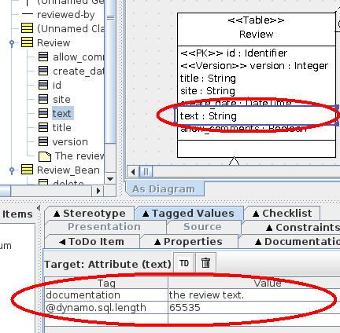

# Tutorial
Ada Web Application is a complete framework that allows to write
web applications using the Ada language. Through a complete web application,
the tutorial explains various
aspects in setting up and building an application by using AWA.

The tutorial assumes that you have already installed the following software on your
computer:

* The [GNAT Ada compiler](http://libre.adacore.com/tools/gnat-gpl-edition/),
* The Ada Web Application framework and its associated dependencies ([XML/Ada](http://libre.adacore.com/tools/xmlada/) and [AWS](https://github.com/AdaCore/aws)),
* The [Dynamo](https://github.com/stcarrez/dynamo) code generator.

The [ArgoUML](https://github.com/argouml-tigris-org/argouml) modelization tool is
provided by the [Dynamo](https://github.com/stcarrez/dynamo) package.  Since this
is a Java application, it uses the Java JRE (either 1.8 or 1.11, the OpenJDK 1.11
is recommended).

## The review web application

The review web application allows users to write reviews about a product, a software
or a web site and share them to the Internet community.
The community can read the review, participate by adding comments and voting for
the reviewed product or software.



The AWA framework provides several modules
that are ready to be used by our application. The login and user management is
handled by the framework so this simplifies a lot the design of our application.
We will see in the tutorial how we can leverage this to our review application.

Because users of our review web application have different roles,
we will need permissions to make sure that only reviewers can modify a review.
We will see how the AWA framework leverages the Ada Security library to enforce the permissions.


The AWA framework also integrates three other
modules that we are going to use: the
[Tags Module](AWA_Tags.md),
the [Votes Module](AWA_Votes.md)
and the [Comments Module](AWA_Comments.md).

Since many building blocks are already provided by the AWA framework, we will
be able to concentrate on our own review application module.

## Setting up the project

### Project creation with [Dynamo](https://github.com/stcarrez/dynamo)

The first step is to create the new project. Since creating a project from scratch is never easy
we will use the [Dynamo](https://github.com/stcarrez/dynamo) tool to build our initial review web application.
Dynamo is a command line tool that provides several commands that help in several development tasks.
For the project creation we will give:

* the output directory,
* the project name,
* the license to be used for the project,
* the project author's email address.

Choose the project name with care as it defines the
name of the Ada root package that will be used by the project.
For the license, you have the choice between [GPL v2](http://opensource.org/licenses/GPL-2.0),
[GPL v3](http://opensource.org/licenses/GPL-3.0), [MIT](http://opensource.org/licenses/MIT),
[BSD 3 clauses](http://opensource.org/licenses/BSD-3-Clause),
[Apache 2](http://opensource.org/licenses/Apache-2.0) or some proprietary license.

```
dynamo -o atlas create-project -l apache atlas email@domain.com
```

The [Dynamo](https://github.com/stcarrez/dynamo) project creation will build the `atlas` directory and populate it with many files:

* A set of configure, Makefile, GNAT project files to build the project,
* A set of Ada files to build your Ada web application,
* A set of presentation files for the web application.

Once the project is created, we must configure it to find the Ada compiler, libraries and so on.
This is done by the following commands:

```
cd atlas
./configure
```

At this step, you may even build your new project and start it. The `make` command will build the Ada
files and create the `bin/atlas-server` executable that represents the web application.

```
make generate build
bin/atlas-server start
```

Once the server is started, you may point your browser to the following location:

```
http://localhost:8080/atlas/index.html
```

### Creating the review module with [Dynamo](https://github.com/stcarrez/dynamo)

With the Ada Web Application framework, a web application is composed of modules where each module
brings a specific functionality to the application.  AWA provides a module for
user management, another for comments, tags, votes, and many others.
The application can decide to use these modules or not.
The AWA module framework helps in defining the architecture and designing your web application.

For the review web application we will create our own module dedicated for the review management.
The module will be an Ada child package of our root project package.  From the Ada
point of view, the final module will be composed of the following packages:

* A `Modules` package represents the business logic of the module. It is provides operations to access and manage the data owned by the module.
* A `Beans` package holds the Ada beans that make the link between the presentation layer and business logic.
* A `Models` package holds the data model to access the database content. This package is generated from UML and will be covered by a next tutorial.

To help in setting up a new AWA module, the [Dynamo](https://github.com/stcarrez/dynamo) tool provides the
`add-module` command.  You just have to give the name of the module,
which is the name of the Ada child package.  Let's create our `reviews` module now:

```
dynamo add-module reviews
```

The command generates the new AWA module and modifies some existing files to
register the new module in the application. You can build your web application at this
stage even though the new module will not do anything yet for you.

## Designing the data model

Our review web application will need to access a database to store the review information.
For this, we must define a data model that will describe how the information is stored in
the database and how we can access such information from Ada.

A [Model Driven Engineering](http://en.wikipedia.org/wiki/Model-driven_engineering)
or [MDE](http://en.wikipedia.org/wiki/Model-driven_engineering) promotes
the use of models to ease the development of software and systems.
The [Unified Modeling Language](http://en.wikipedia.org/wiki/Unified_Modeling_Language) is used
to modelize various parts of the software. UML is a graphical type modelling language and
it has many diagrams but we are only going to use one of them:
the [Class Diagram](http://en.wikipedia.org/wiki/Class_diagram).

The class diagram is probably the most powerful diagram to design, explain and
share the data model of any application. It defines the most important data types used
by an application with the relation they have with each other. In the class diagram, a
class represents an abstraction that encapsulates data member attributes and operations.
The class may have relations with others classes.

### ArgoUML setup

When using a UML modelization, two specific profiles must be configured before using the tool:

* The [Dynamo](https://github.com/stcarrez/dynamo) profile that describes the base data types for our UML model.  These types are necessary for the code generator to work correctly.
* The AWA profile that describes the tables and modules provided by AWA. We will need it to get the user UML class definition.

These UML profiles are located in the `/usr/share/dynamo/base/uml`
directory after [Dynamo](https://github.com/stcarrez/dynamo) and AWA are installed.

When you use the `argouml` command provided by the [Dynamo](https://github.com/stcarrez/dynamo) package,
the UML profiles should already be accessible and you have nothing to setup.

If you have installed ArgoUML by downloading it, you must setup these UML profiles.
To configure [ArgoUML](https://github.com/argouml-tigris-org/argouml),
go in the `Edit -> Settings` menu
and add the directory in the `Default XMI directories` list.  Beware that you must
restart [ArgoUML](http://argouml.tigris.org/) to be able to use the new profiles.



Once the directory is added, restart [ArgoUML](https://github.com/argouml-tigris-org/argouml),
go again in `Edit -> Settings` menu and select the `AWA.xmi` and `Dynamo.xmi`
profiles.  As soon as they are selected and applied on the configuration,
you should restart [ArgoUML](https://github.com/argouml-tigris-org/argouml) another time
for these two profiles to become usable.

### Modelize the domain model in UML

The UML model must use a number of [Dynamo](https://github.com/stcarrez/dynamo) artifacts for the code generation to work properly.
The artifact describes some capabilities and behavior for the code generator to perform its work.
Stereotype names are enclosed within `<<` and `>>` markers. [Dynamo](https://github.com/stcarrez/dynamo) uses the following stereotypes:

* The `DataModel` stereotype must be applied on the package which contains the model to generate.  This stereotype activates the code generation (other packages are not generated).
* The `Table` stereotype must be applied to the class.  It controls which database table and Ada type will be generated.
* The `PK` stereotype must be defined in at most one attribute of the class. This indicates the primary key for the database table. The attribute type must be an integer or a string. This is a limitation of the Ada code generator.
* The `Version` stereotype must be applied on the attribute that is used for the [optimistic locking](http://en.wikipedia.org/wiki/Optimistic_concurrency_control) implementation of the database layer.
* The `Auditable` stereotype can be applied to some attributes and relations when you want to audit changes to these attributes or relations. When used, the ADO framework will track changes and automatically record them in a specific auditing table.


In our UML model, the `Review` table is assigned the `Table` stereotype
so that an SQL table will be created as well as an Ada tagged type to represent our table.
The `id` class attribute represents the primary key and thus has
the `PK` stereotype.  The `version` class attribute is the database column
used by the [optimistic locking](http://en.wikipedia.org/wiki/Optimistic_concurrency_control)
implementation provided by [Ada Database Objects](https://github.com/stcarrez/ada-ado). This is why is has
the `Version` stereotype. The `title`, `site`, `create_date`,
`text` and `allow_comments` attributes represent the information we
want to store in the database table.  They are general purpose attributes and thus
don't need any specific stereotype.  For each attribute, the [Dynamo](https://github.com/stcarrez/dynamo)
code generator will generate a getter and a setter operation that can be used in the Ada code.

To tune the generation, several UML tagged values can be selected and added on the table
or on a table attribute.   By applying a stereotype to the class, several tagged
values can be added.  By selecting the `Tagged Values` tab in ArgoUML 
we can edit and setup new values.  For the `Review` table, the
`dynamo.table.name` tagged value defines the name of the SQL database table,
in our case `atlas_review`.


The `text` attribute in the `Review` table is a string that can hold some
pretty long text.  To control the length of the SQL column, we can set the
`dynamo.sql.length` tagged value and tell what is that length.



Once the UML model is designed, it is saved in the project directory `uml`.
Dynamo will be able to read the ArgoUML file format (`.zargo` extension) so
there is no need to export the UML in XMI.


### Adding relations in the UML model

The final UML model of our review application is fairly simple.
We just added a table and a bean declaration.  To benefit from the
user management
in AWA, we can use the `AWA::Users::Models::User` class that is defined in the AWA UML model.
The `reviewed-by` association will create an attribute `reviewer`
in our class.  The code generator will generate a `Get_Reviewer` and
`Set_Reviewer` operation in the Ada code.  The SQL table will contain
an additional column `reviewer` that will hold the primary key of the reviewer.


The `Review_Bean` class is an Ada Bean abstract class
that will be generated by the code generator. The `Bean` stereotype activates the bean code generator
and the generator will generate some code support that is necessary to turn the `Review_Bean` tagged
record into an Ada Bean aware type. We will see in the section
that we will only have to implement the `save` and `delete` operation
that are described in this UML model.

### Makefile setup

The `Makefile` that was generated by
the [Dynamo](https://github.com/stcarrez/dynamo) `create-project`
command must be updated to setup a number of generation arguments for
the UML to Ada code generator.  Edit the `Makefile` to change `DYNAMO_ARGS` into:

```
DYNAMO_ARGS=--package Atlas.Reviews.Models db uml/atlas.zargo
```
The `--package` option
tells [Dynamo](https://github.com/stcarrez/dynamo) to generate only
the model for the specified package. The `db` directory is the directory
that will contain the SQL model files.

### Generating the Ada model

To run the generator, we can use the `generate` make target:

```
make generate
```

The [Dynamo](https://github.com/stcarrez/dynamo) code generator reads the
file `uml/atlas.zargo` and the UML model it contains and generates:

* the Ada package `Atlas.Reviews.Models` which contains the definition of the `Review` table. The model files are created in the directory `src/models` which is separate from your Ada sources.  You can safely remove the files in `src/models` and have them re-built by using [Dynamo](https://github.com/stcarrez/dynamo).  It is not recommended to modify these files.
* the SQL files to create the MySQL or SQLite database.  Depending on the AWA modules which are used, the generated SQL files will contain additional tables that are used by the AWA modules. The SQL files are generated in the `db/mysql`, `db/sqlite` and `db/postgresql` directories.

### Creating the database

Until now we designed our application UML model, we have our Ada code generated,
but we need a database with the tables for our application.  We can do this
by using the `create-database` command in [Dynamo](https://github.com/stcarrez/dynamo). This command needs
several arguments:

* The directory that contains the SQL model files.  In our case, this is `db`.
* The information to connect to the database, the database name, the user and its password. This information is passed in the form of a database connection string.
* The name of the database administration account to connect to the server and create the new database.
* The optional password for the database administration account.

If the MySQL server is running on your host and the admin account does not have any password, you can use the following command:
```
dynamo create-database \
   db 'mysql://localhost/demo_atlas?user=demo&password=demo' root
```

The `create-database` creates the database (`demo_atlas`) with
the tables that are necessary for the application.  It also creates the `demo`
user and give it the necessary MySQL grants to connect to the `demo_atlas`
database.

## Adding a creation form

We will start with the presentation layer by adding two pages in our web application.
A first page will contain the list of reviews and the second page will contain a form to create
or update a review.

AWA uses the [Facelets](http://en.wikipedia.org/wiki/Facelets) technology to allow
developers write and design the presentation layer of the web application.
This technology is commonly used in J2EE applications.
A page is represented by an XML file that contains HTML code, includes some stylesheets,
Javascript files and makes the link between the presentation and the web application.

### Adding pages

Dynamo provides at least two commands that help in adding presentation files.
The `add-page` command adds a simple page that can be edited and filled
with real content. We will use it for the creation of the page to display the list of reviews.

```
dynamo add-page reviews/list
```

The `add-form` command creates another template of page that includes
an HTML form to let a user submit some data to the web application.

```
dynamo add-form reviews/edit-review
```

These two commands will create the following files and they can now be modified.

```
./web/reviews/list.xhtml
./web/reviews/edit-review.xhtml
./web/reviews/forms/edit-review-form.xhtml
```

### The create review form

In [Facelets](http://en.wikipedia.org/wiki/Facelets), an HTML form is created by using
the `<h:form>` component
from the [HTML JSF](http://demo.vacs.fr/demo/jsf/html/view.html) namespace.  This component
will generate the HTML `form` tag and it will also manage the form submission.

The [Ada Server Faces](https://github.com/stcarrez/ada-asf) provides a
set of [widget components](http://demo.vacs.fr/demo/widgets/view.html) that facilitate the design
of web application. The `<w:inputText>` component renders a title field with
an HTML `<label>` and an HTML `<input>` text.  We will use it to
let the user enter the review title and the site URL being reviewed. The HTML `<textarea>`
is provided by the JSF component `<h:inputTextArea>`.  The review submit form
is defined by the following XML extract:
```
<h:form xmlns:h="http://java.sun.com/jsf/html
  xmlns:w="http://code.google.com/p/ada-asf/widget">
  <h:inputHidden id='entity-id' value='#{review.id}' required='false'/>
  <w:inputText title='Title' value='#{review.title}'/>
  <w:inputText title='Site' value='#{review.site}'/>
  <h:inputTextArea rows='20' value='#{review.text}'/>
  <h:commandButton value='Save'
     action='#{review.save}'/>
</h:form>
```

Before closing the `<h:form>` component, we will put a `<h:commandButton>` that will render the form submit button.

### How it works

Before going further, let's see how all this works.  The principle below is exactly the
same for a [Java Server Faces](http://en.wikipedia.org/wiki/JavaServer_Faces)
application.

First, when the page is rendered the [UEL](http://en.wikipedia.org/wiki/Unified_Expression_Language)
expressions that
it contains are evaluated.  The `#{review.title}`, `#{review.site}` and `#{review.text}` are replaced by the content provided by the `review` object
which is an  Ada Bean provided by the `Review_Bean` tagged record.

When the page is submitted by the user, the input values submitted in the form
are saved in the `review` bean, again by using
the [UEL](http://en.wikipedia.org/wiki/Unified_Expression_Language) expression.
The `<h:commandButton>` action is then executed. This is also
an [UEL](http://en.wikipedia.org/wiki/Unified_Expression_Language) that
indicates a method to invoke on the bean.

To sum up, the [UEL](http://en.wikipedia.org/wiki/Unified_Expression_Language)
makes the binding between the presentation layer in [Facelets](http://en.wikipedia.org/wiki/Facelets)
files and the Ada or Java beans.

The Ada Bean layer provides getter
and setter to allow the [UEL](http://en.wikipedia.org/wiki/Unified_Expression_Language)
to retrieve and set
values.  For this, the `Review_Bean` tagged record implements two
operations that are defined in the `[Bean](https://github.com/stcarrez/ada-util/source/browse/trunk/src/util-beans-basic.ads)` interface:

```
overriding
function Get_Value (From : in Review_Bean;
                    Name : in String) return Util.Beans.Objects.Object;

overriding
procedure Set_Value (From : in out Review_Bean;
                    Name : in String;
                    Value : in Util.Beans.Objects.Object);
```

The `Get_Value` operation is called to retrieve one of the Ada Bean member attribute and
the `Set_Value` operation is called during form submission to set the member attribute.


Then the form button is pressed, the HTML form is submitted and received by the server.
The `<h:form>` component identifies the form submission and each input component
will validate the input fields.  When everything has been validated, the `<h:commandButton>` component invokes the `Save` procedure that is declared as follows in the
`Review_Bean` tagged record:

```
overriding
procedure Save (Bean : in out Review_Bean;
                Outcome : in out Ada.Strings.Unbounded.Unbounded_String);
```


In the Ada Bean layer, we have to call the business logic to perform the
`save` operation.

The business logic part is provided by the Ada module whose initial skeleton was generated by [Dynamo](https://github.com/stcarrez/dynamo).
That layer is responsible for defining how the data is created, retrieved and modified.
As far as we are concerned, this is rather simple since we only have to verify
the permission and save the review object within some transaction.
In other modules, several objects may be envolved and more complex rules
may be defined for the integrity and validity of these objects.

The last part of the architecture is the data model layer that was in fact
generated by [Dynamo](https://github.com/stcarrez/dynamo) from the UML model. It is responsible for loading and
saving Ada objects into the database.

### The Review_Bean type declaration

When we designed our UML model, we have created the `Review_Bean`
UML class and gave that class the `Bean` stereotype.  We also declared
two operations (`save` and `delete`) on that class.  With this
definition, [Dynamo](https://github.com/stcarrez/dynamo) has generated in the `Atlas.Reviews.Models` package
the `Review_Bean` abstract type.  This type is abstract because we have
to implement the `Save` and `Delete` operations. These are the two
operations that can be called by an action such as used by the `<h:commandButton>` component.

The `Atlas.Reviews.Models` package is a generated package and it must
not be modified.  To implement our  Ada Bean, we will add the `Review_Bean`
type in our own package: the `Atlas.Reviews.Beans` package.

For this the `Review_Bean` type will inherit from the `Atlas.Reviews.Models.Review_Bean` type and it will implement
the required operations.  The type declaration looks like this:

```
package Atlas.Reviews.Beans is
...
type Review_Bean is new Atlas.Reviews.Models.Review_Bean with record
   Module : Atlas.Reviews.Modules.Review_Module_Access := null;
end record;
...
```

### The Review_Bean implementation

The `Save` and `Delete` procedure must be implemented
and since the whole business logic is managed by the module layer, we just
have to call the associated module procedure as follows:
```
overriding
procedure Save (Bean : in out Review_Bean;
                Outcome : in out Ada.Strings.Unbounded.Unbounded_String);
begin
   Bean.Module.Save (Bean);
end Save;

overriding
procedure Delete (Bean : in out Review_Bean;
                Outcome : in out Ada.Strings.Unbounded.Unbounded_String);
begin
   Bean.Module.Delete (Bean);
end Delete;
```

### The Review_Bean creation

The AWA framework must be able to create the `review` bean
instance when a page is processed. For this, there are three steps that are necessary:

* we must define a create function whose role is to allocate the `Review_Bean` instance and return it. At the same time, the function can setup some pre-defined values for the object. The [Dynamo](https://github.com/stcarrez/dynamo) tool has generated for us an example of such function so that there is nothing to do.

```
function Create_Review_Bean (Module : in Atlas.Reviews.Modules.Review_Module_Access)
   return Util.Beans.Basic.Readonly_Bean_Access is
   Object : constant Review_Bean_Access := new Review_Bean;
begin
   Object.Module := Module;
   return Object.all'Access;
end Create_Review_Bean;
```

* the creation function must be registered in the AWA framework under a name that
identifies the create function. Again, an example of this registration has been
generated by [Dynamo](https://github.com/stcarrez/dynamo) and we are going to use it as is.

```
Register.Register (Plugin => Plugin,
                 Name   => "Atlas.Reviews.Beans.Reviews_Bean",
                 Handler => Atlas.Reviews.Beans.Create_Review_Bean'Access);
```

* the last step is the configuration step. In the module XML configuration file, we must declare the Ada bean name and indicate what create function must be called to create it. We will use the [managed-bean  XML declaration](http://docs.oracle.com/javaee/5/tutorial/doc/bnawq.html) that comes from
[Java Server Faces](http://en.wikipedia.org/wiki/JavaServer_Faces). We can declare
as many Ada beans as we want each of them with a different name.

```
<managed-bean>
  <description>An example of a bean (change description and bean name)</description>
  <managed-bean-name>review</managed-bean-name>
  <managed-bean-class>Atlas.Reviews.Beans.Reviews_Bean</managed-bean-class>
  <managed-bean-scope>request</managed-bean-scope>
</managed-bean>
```

When the [UEL](http://en.wikipedia.org/wiki/Unified_Expression_Language)
expression `#{review.title}` is used, the AWA framework looks for the Ada bean represented
by `review` and identified by the `managed-bean-name` entry.  It then calls the create function
defined by the `managed-bean-class`. The Ada bean object is then stored either in the __request__ context,
a __session__ context or an __application__ context. This is defined by the `managed-bean-scope` entry.
The __request__ scope means that the Ada bean object is created once for each request. Concurrent page accesses will use their own Ada bean object instance.  The __session__ scope means that the Ada bean object is shared between requests
on the same session.  The __application__ scope means that the Ada bean object is global to the application, shared by
every request and every session.

### Navigation rules

We have seen that when the review creation form is submitted the `<h:commandButton>`
component has invoked the `Save` procedure of our `Review_Bean` object.
The review object has been created and saved in the database and we kept the relation between
the new review and the user.

We must now decide what should happen for the user to see the result.
We could display a new form, update some page content or redirect to a new page.
All this is defined by the navigation rules.

The navigation rules is the [Java Server Faces](http://en.wikipedia.org/wiki/JavaServer_Faces)
mechanism that controls and defines what is the next page or view that must be displayed to a user.
The navigation rules are configured in the module XML configuration file.

In the definition below, the navigation rule defines that the user is redirected to
the page `/reviews/list.xhtml` if the current page was `/reviews/edit-review.xhtml`
and the operation returned `success`.
```
<navigation-rule>
  <from-view-id>/reviews/edit-review.xhtml</from-view-id>
    <navigation-case>
      <from-outcome>success</from-outcome>
      <to-view-id>/reviews/list.xhtml</to-view-id>
      <redirect/>
    </navigation-case>
</navigation-rule>
```

## Creating the module

### Adding the module operations

Now, we must add two operations on the business logic to save a review and delete a review.
The [Dynamo](https://github.com/stcarrez/dynamo) code generator provides the `add-module-operation` command
that will help us in this task.  Let's run it:
```
dynamo add-module-operation reviews review Save
dynamo add-module-operation reviews review Delete
```

The first parameter is the name of the module where the new operation is added.
This is the name of the module that was created by using the `add-module`
operation.  In our case, this is the `reviews` module.

The second parameter is the name of the database entity or database table if you prefer.

The `add-module-operation` command modifies the Ada module specification
and body to define and implement the following operation:
```
package Atlas.Reviews.Modules is
...
procedure Save (Model  : in Review_Module;
                Entity : in out Atlas.Reviews.Models.Review_Ref'Class);
...
```

The object to save in the `Review` table is passed as parameter to the
Save operation. The procedure body that was generated is rather simple but functional:
it just saves the object in the database within a transaction.  In many cases it is ready
to use but you may also need to modify the operation to either change the implementation
or even add new parameters.

### Saving our review

Before saving our review entity object, we want to associate it with the current user. We have to know
who is the current user and for this we can use the AWA service context.  The AWA service context is an object
that is provided by the `AWA.Services.Contexts` package and that provides some useful contextual
information for the business logic:

* It indicates the optional user that is authenticated and is doing the call,
* It gives access to the database connections that the business logic can use,
* It allows to manage database transactions.

The current service context is retrieved by using the `AWA.Services.Contexts.Current` function
and we can use the `Get_User` function to know the current user.  The `Save` procedure
implementation is the following:

```
package ASC renames AWA.Services.Contexts;
procedure Save (Model  : in Review_Module;
                Entity : in out Atlas.Reviews.Models.Review_Ref'Class) is
   Ctx   : constant ASC.Service_Context_Access := ASC.Current;
   DB    : ADO.Sessions.Master_Session := AWA.Services.Contexts.Get_Master_Session (Ctx);
begin
   Ctx.Start;
   if not Entity.Is_Inserted then
      Entity.Set_Reviewer (Ctx.Get_User);
      Entity.Set_Create_Date (Ada.Calendar.Clock);
   end if;
   Entity.Save (DB);
   Ctx.Commit;
end Save;
```

### Setting up the permissions

Because we want to bring some minimal security to the review web application,
we are going to setup some permissions that will be enforced by the
business logic layer when a save or delete operation is done.
The AWA framework uses the [Ada Security](https://github.com/stcarrez/ada-security)
to implement and enforce permissions.  For this we need:

* An Ada definition of the permission,
* Adding a verification to enforce the permission in the new module operations,
* A definition of the permission rules.

#### Generating the permission

Dynamo provides the `add-permissions` command to help us in the first task.
It generates some Ada code that declares the permissions.  It also
provides a default configuration for the new permissions.

```
dynamo add-permissions reviews review
```

The first parameter is the name of our module where the new permissions are
declared and the second parameter is the name of the database entity.
The command will modify the Ada module specification and add the following lines:

```
package Atlas.Reviews.Modules is
...
package ACL_Create_Reviews is new Security.Permissions.Definition ("review-create");
package ACL_Delete_Reviews is new Security.Permissions.Definition ("review-delete");
package ACL_Update_Reviews is new Security.Permissions.Definition ("review-update");
```

Each of these package instantiation, declares a single permission identified by a name.

#### Enforcing security

Now that we have our permission, we can enforce the security in the `Save` and
`Delete` operation. This is done by using the `Check` operation
provided by the `AWA.Permissions` package.

To verify that the user has the permission to create a new review, we can use
the following call:
```
AWA.Permissions.Check (Permission => ACL_Create_Reviews.Permission);
```

This operation will verify that the user has the given permission and it will
raise the `AWA.Permissions.NO_PERMISSION` exception if this is not the case.
By raising such exception, the `Check` procedure acts as a barrier that grants
or not the access to the rest of the code.

Now, if we have a review to modify, we will use the update permission and
also give the review object to the `Check` operation so that it can verify
if that particular review can be modified.
```
AWA.Permissions.Check (Permission => ACL_Update_Reviews.Permission,
                       Entity => Entity);
```

#### Configuring the permission

Until now we have created the permission and enforced it in the business logic.
We have not defined the rules that tell what is really checked to verify the permission.
The configuration part is defined in the XML file `config/reviews.xml` that
was generated when the reviews module was created.  The `add-permissions`
command has modified the XML file to provide some default configuration.  It has generated
a XML permission for the `review-create`, `review-update` and `review-delete` 
permissions.

The `review-create` permission is defined as follows:

```
<auth-permission>
    <name>review-create</name>
</auth-permission>
```

This XML definition associate
the [Authenticated Permission](https://github.com/stcarrez/ada-securitywiki/Security_Policies#Authenticated_Permission) controller to the `review-create`
permission.
With that controller the permission is granted if the security context has a principal
(ie, a user is authenticated).

The `review-update` permission has another definition that we must change.
Basically, we want that only the reviewer that created the review can update the review.
For this we will use the entity permission controller provided by AWA.  The XML
definition is the following:
```
<entity-permission>
    <name>review-update</name>
    <entity-type>altas_review</entity-type>
    <sql>
       SELECT r.id FROM atlas_review AS r
       WHERE r.id = :entity_id AND r.reviewer_id = :user_id
    </sql>
</entity-permission>
```

When the permission is checked, the entity permission controller will use the SQL
statement to verify the permission. The SQL statement has three parameters:

* `user_id` is the ID of the user associated with the security context. If there is no authentified user, the permission is refused.
* `entity_id` is the ID of the database entity as passed to the `Check` procedure and propagated to the permission controller.
* `entity_type` is a unique number that identifies the database entity type or database table if you prefer. It is created and setup automatically according to the entity type defined in the `entity-type` XML member. It is not used in our example.

At the end, the above SQL statement verifies that the review exists and was created by
the current user.

## Using database queries

Our next step is now to list the reviews that have been created.  We need to add a page
that will list the reviews and we need to implement a database query to fetch the information.


### Adding database queries

Since we need to access the list of reviews from the XHTML files, we will map the SQL query result
to a list of Ada Beans objects.  For this,
an [XML query mapping|https://code.google.com/p/ada-ado/wiki/QueryMapping] is created to
tell how to map the SQL query result into some Ada record. The XML query mapping is then processed
by  [Dynamo](https://github.com/stcarrez/dynamo) to generate the Ada Beans implementation.  The XML query mapping
is also read by AWA to get the SQL query to execute.

A template of the XML query mapping can be added to a project by using the dynamo
`add-query` command.  The first parameter is the module name (`reviews`)
and the second parameter the name of the query (`list`).  The command will generate the file
`db/reviews-list.xml`.

```
dynamo add-query reviews list
```

The generated XML query mapping is an example of a query.  You can replace it or update it
according to your needs.  The first part of the XML query mapping is a `class` declaration
that describes the type to represent each row returned by our query.  Within the `class`,
a set of `property` definition describes the class attributes with their type and name.

```
<query-mapping package='Atlas.Reviews.Models'>
    <class name="Atlas.Reviews.Models.List_Info" bean="yes">
        <comment>The list of reviews.</comment>
        <property type='Identifier' name="id">
            <comment>the review identifier.</comment>
        </property>
        <property type='String' name="title">
            <comment>the review title.</comment>
        </property>
        ...
    </class>
</query-mapping>
```

Following the `class` declaration, the `query` declaration describes a query
by giving it a name and describing the SQL statement to execute.  By having the SQL statement
separate and external to the application, we can update, fix and tune the SQL without rebuilding
the application.  The [Dynamo](https://github.com/stcarrez/dynamo) code generator will use
the `query` declaration to generate a query definition that can be referenced and used from
the Ada code.

The SQL statement is defined within the `sql` XML entity.  The optional
`sql-count` XML entity is used to associate a count query that can be used for the pagination.

We want to display the review with the author's name and email address.
The list will be sorted by date to show the newest reviews first.  The SQL to execute
is the following:

```
<query-mapping package='Atlas.Reviews.Models'>
   ...
    <query name='list'>
       <comment>Get the list of reviews</comment>
       <sql>
SELECT
      r.id,
      r.title,
      r.site,
      r.create_date,
      r.allow_comments,
      r.reviewer_id,
      a.name,
      e.email,
      r.text
FROM atlas_review AS r
INNER JOIN awa_user AS a ON r.reviewer_id = a.id
INNER JOIN awa_email AS e ON a.email_id = e.id
ORDER BY r.create_date DESC
    LIMIT :first, :last
       </sql>
       <sql-count>
    SELECT
      count(r.id)
    FROM atlas_review AS r
       </sql-count>
    </query>
</query-mapping>
```
The query has two named parameters represented by `:first` and `:last`.
These parameters allow to paginate the list of reviews.

The complete source can be seen in the file: [db/reviews-list.xml](https://github.com/stcarrez/atlas/blob/master/db/reviews-list.xml).

Once the XML query is written, the Ada code is generated by [Dynamo](https://github.com/stcarrez/dynamo) by reading the UML
model and all the XML query mapping defined for the application. [Dynamo](https://github.com/stcarrez/dynamo) merges all the definitions into the target Ada packages and generates the Ada code in the `src/model` directory.  You can use the `generate`
make target:

```
make generate
```
or run the following command manually:
```
dynamo generate db uml/atlas.zargo
```

From the `List_Info` class definition, [Dynamo](https://github.com/stcarrez/dynamo) generates the
`List_Info` tagged record.  The record contains all the data members described in
the `class` XML entity description.  The `List_Info` represents one row returned
by the SQL query. The attributes of the `List_Info` can be accessed from the
XHTML files by using UEL expression and the property name defined for each attribute.

To describe the list of rows, [Dynamo](https://github.com/stcarrez/dynamo) generates the `List_Info_Beans` package which instantiates the
`Util.Beans.Basic.Lists` generic package. This provides an Ada vector for the
`List_Info` type and an Ada bean that gives access to the list.

```
package Atlas.Reviews.Models is
  ...
  type List_Info is new Util.Beans.Basic.Readonly_Bean with record
  ...
   package List_Info_Beans is
      new Util.Beans.Basic.Lists (Element_Type => List_Info);
   package List_Info_Vectors renames List_Info_Beans.Vectors;
   subtype List_Info_List_Bean is List_Info_Beans.List_Bean;
   subtype List_Info_Vector is List_Info_Vectors.Vector;
   Query_List : constant ADO.Queries.Query_Definition_Access;
   ...
end Atlas.Reviews.Models;
```
The generated code can be seen in [src/model/atlas-reviews-models.ads](https://github.com/stcarrez/atlas/blob/master/src/model/atlas-reviews-models.ads#L188).

### Implementing the review list bean

In order to access the list of reviews from the XHTML facelet file, we must create an Ada bean
that provides the list of reviews. This Ada bean is modelized in the UML model and we define:

* A set of attributes to manage the review list pagination (`page`, `page_size`, `count`)
* An Ada bean action that can be called from the XHTML facelet file (`load`)

The `Review_List_Bean` tagged record will hold the list of reviews for us:
```
package Atlas.Reviews.Beans is
  ...
   type Review_List_Bean is new Atlas.Reviews.Models.Review_List_Bean with record
      Module       : Atlas.Reviews.Modules.Review_Module_Access := null;
      Reviews      : aliased Atlas.Reviews.Models.List_Info_List_Bean;
      Reviews_Bean : Atlas.Reviews.Models.List_Info_List_Bean_Access;
   end record;
   type Review_List_Bean_Access is access all Review_List_Bean'Class;
end Atlas.Reviews.Beans;
```

We must now implement the `Load` operation that was described in the UML model
and we are going to use our `list` query. For this, we use the `ADO.Queries.Context` to setup the query to retrieve the list of reviews.
A call to `Set_Query` indicates the query that will be used.  Since that query needs two
parameters (`first` and `last`), we use the `Bind_Param` operation to
give the two values.  The list of reviews is then retrieved easily by calling the
`Atlas.Reviews.Models.List` operation that was generated by [Dynamo](https://github.com/stcarrez/dynamo).

```
package body Atlas.Reviews.Beans is
...
   overriding
   procedure Load (Into    : in out Review_List_Bean;
                   Outcome : in out Ada.Strings.Unbounded.Unbounded_String) is
      Session     : ADO.Sessions.Session := Into.Module.Get_Session;
      Query       : ADO.Queries.Context;
      Count_Query : ADO.Queries.Context;
      First       : constant Natural  := (Into.Page - 1) * Into.Page_Size;
      Last        : constant Positive := First + Into.Page_Size;
   begin
      Query.Set_Query (Atlas.Reviews.Models.Query_List);
      Count_Query.Set_Count_Query (Atlas.Reviews.Models.Query_List);
      Query.Bind_Param (Name => "first", Value => First);
      Query.Bind_Param (Name => "last", Value => Last);
      Atlas.Reviews.Models.List (Into.Reviews, Session, Query);
      Into.Count := ADO.Datasets.Get_Count (Session, Count_Query);
   end Load;
end Atlas.Reviews.Beans;
```

### Review list bean creation

The AWA framework must be able to create an instance of the `Review_List_Bean` type.
For this, we have to declare and implement a constructor function that allocates
an instance of the `Review_List_Bean` type and setup some pre-defined values.
When the instance is returned, the list of reviews is not loaded.
```
package body Atlas.Reviews.Beans is
   ...
   function Create_Review_List_Bean (Module : in Atlas.Reviews.Modules.Review_Module_Access)
                                     return Util.Beans.Basic.Readonly_Bean_Access is
      Object  : constant Review_List_Bean_Access := new Review_List_Bean;
   begin
      Object.Module       := Module;
      Object.Reviews_Bean := Object.Reviews'Access;
      Object.Page_Size    := 20;
      Object.Page         := 1;
      Object.Count        := 0;
      return Object.all'Access;
   end Create_Review_List_Bean;
end Atlas.Reviews.Beans;
```

The constructor function is then registered in the `Atlas.Reviews.Modules` package within
the `Initialize` procedure.  This registration allows to give a name for this constructor
function and be able to specify it in the `managed-bean` bean declaration.

```
package body Atlas.Reviews.Modules is
   ...
   overriding
   procedure Initialize (Plugin : in out Review_Module;
                         App    : in AWA.Modules.Application_Access;
                         Props  : in ASF.Applications.Config) is
   begin
      ...
      Register.Register (Plugin => Plugin,
                         Name   => "Atlas.Reviews.Beans.Review_List_Bean",
                         Handler => Atlas.Reviews.Beans.Create_Review_List_Bean'Access);
   end Initialize;
end Atlas.Reviews.Modules;
```


### Review list bean declaration

The [managed-bean XML declaration](http://docs.oracle.com/javaee/5/tutorial/doc/bnawq.html) associates a name to a constructor function that will be called when the name is needed.
The scope of the Ada bean is set to `request` so that a new instance is created for
each [HTTP GET](http://tools.ietf.org/html/rfc2616#section-9.3) request.
```
<managed-bean>
  <description>The list of reviews</description>
  <managed-bean-name>reviewList</managed-bean-name>
  <managed-bean-class>Atlas.Reviews.Beans.Review_List_Bean</managed-bean-class>
  <managed-bean-scope>request</managed-bean-scope>
</managed-bean>
```

Two other scopes are allowed: `session` and `application`.
The `session` scope indicates that the new instance is created and associated
with the user browsing session.  It allows to share some instance between
several HTTP requests.  Care must be made when designing the Ada bean instance
because concurrent HTTP requests can access and modify the Ada bean concurrently.

The `application` scope associates the new instance globally to the application.
It means the instance is shared across all requests concurrently.

### Listing the reviews: the XHTML facelet presentation file

To load the reviews to be displayed we will use a [JSF 2.2 view action](http://www.oracle.com/technetwork/articles/java/jsf22-1377252.html).
The review list page has a parameter `page` that indicates the page number to be displayed.
The `f:viewParam` allows to retrieve that parameter and configure the `reviewList`
Ada bean with it. Then, the `f:viewAction` defines the action that will be executed
after the view parameters are extracted, validated and passed to the Ada bean. In our case, we will
call the `load` operation on our `reviewList` Ada bean.

```
<f:metadata>
    <f:viewParam id='page' value='#{reviewList.page}' required="false"/>
    <f:viewAction action="#{reviewList.load}"/>
</f:metadata>
```

To summarize, the `reviewList` Ada bean is created, then configured for the pagination
and filled with the current page content by running our SQL query by running the `Load` procedure.

The easy part is now to render the list of reviews.  The XHTML file uses the
[<h:list>](http://demo.vacs.fr/demo/jsf/html/view.html) component to iterate over the list items
and render each of them. At each iteration, the `<h:list>` component initializes the
Ada bean  `review` to refer to the current row in the review list.  We can then access
each attribute defined in the XML query mapping by using the property name of that attribute.
For example `review.title` returns the `title` property.

```
<h:list var="review" value="#{reviewList.reviews}">
    <div class='review' id="p_#{review.id}">
        <div class='review-title'>
            <h2><a href="#{review.site}">#{review.title}</a></h2>
            <ul class='review-info'>
                <li><span>By #{review.reviewer_name}</span></li>
                <li>
                    <h:outputText styleClass='review-date'
                                  value="#{review.date}"
                                  converter="dateConverter"/>
                </li>
                <h:panelGroup rendered="#{review.reviewer_id == user.id}">
                    <li>
                        <a href="#{contextPath}/reviews/edit-review.html?id=#{review.id}">
                           #{reviewMsg.review_edit_label}
                        </a>
                    </li>
                    <li>
                        <a href="#"
                           onclick="return ASF.OpenDialog(this, 'deleteDialog', '#{contextPath}/reviews/forms/delete-review.html?id=#{review.id}');">
                           #{reviewMsg.review_delete_label}
                        </a>
                    </li>
                </h:panelGroup>
            </ul>
        </div>
        <awa:wiki styleClass='review-text post-text' value="#{review.text}" format="dotclear"/>
    </div>
</h:list>
```


### Understanding the request flow

Let's see the whole request flow to better understand what happens.

To display the list of reviews, the user's browser makes an [HTTP GET](http://tools.ietf.org/html/rfc2616#section-9.3) request to the page `/reviews/list.html`.
This page maps to the XHTML file `web/reviews/list.xhtml` that we created in the [Adding pages](#adding-pages) section.

The [Ada Server Faces](https://github.com/stcarrez/ada-asf) framework handles the request by first reading the XHTML file
and building a tree of components that represent the view to render.  Within that tree
of component, the `<f:metadata>` component allows to make a pre-initialization of
components and Ada beans before the component tree is rendered.

For the pre-initialization, the `reviewList` Ada bean is created because it is referenced
in an EL expression used by the `<f:viewParam>` component or by the `<f:viewAction>`.
For this creation, the `Create_Review_List_Bean` constructor that we registered is called.
The `page` attribute is set on the `reviewList` Ada bean if it was passed as a URL
request parameter.

The `load` action is then called by [Ada Server Faces](https://github.com/stcarrez/ada-asf)
which triggers execution of the `Load` procedure and the current review list page
is retrieved by executing the SQL query.

As soon as the `load` action terminates, the rendering of the component tree can be
processed.  The `reviewList` Ada bean contains the information to display and the
`<h:list>` component iterates over the list and renders each row at a time.


